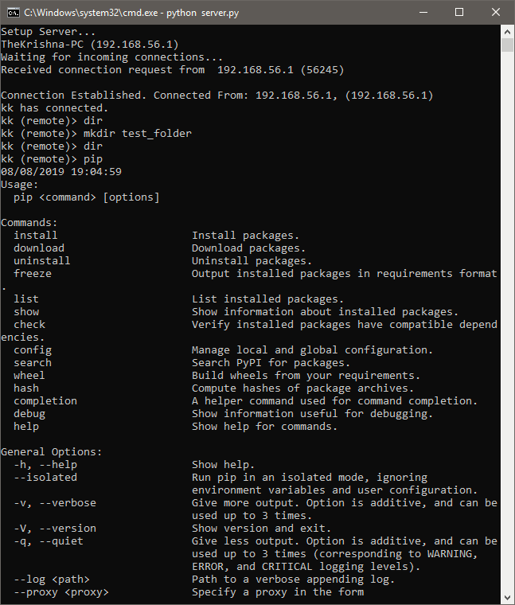
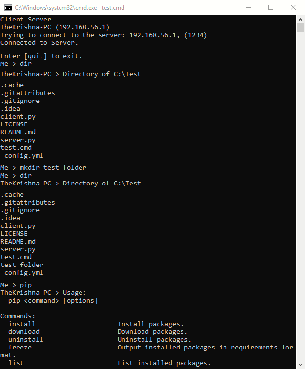

<h1 align="center">
  <br>
  
  <br>
</h1>

<h4 align="center">Making Remote Management Easier</h4>

<p align="center">
  <a href="#"></a>
  <a href="/LICENSE.md"></a>
</p>


With Remote-CMD, you can establish a Terminal session to a computer from another computer that's connected to the same network or to the Internet.

## Usage
On host, run **server.py**

```bash
python3 server.py
```

For Client, use **client.py** (For security reasons, no more than one client can be connected to a remote)

```bash
python3 client.py <IPv4 Address of the server> <client preferred name>

```

## Screenshots

| Host Machine (Server-side)   | Client Machine |
| ------------- | ----------- |
|  |  |


## License
The **Remote-CMD** is licensed under the terms of the [MIT license](LICENSE) and is available for free.

## Links
-   [Issue tracker](https://github.com/K-Kraken/Remote-CMD/issues)
-   [Source code](https://github.com/K-Kraken/Remote-CMD)

## Authors
* **Krishna Alagiri** - [K-Kraken](https://github.com/K-Kraken/)


## Acknowledgments
* Hat tip to anyone whose code was used.
* Myself :P

<br><br>
<p align="center">
  Made with ❤️ by <a href="https://github.com/K-Kraken">Krishna Alagiri</a>
</p>


